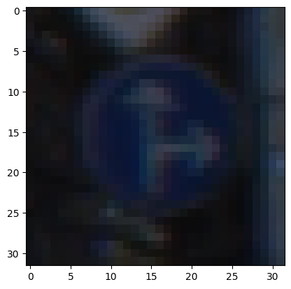
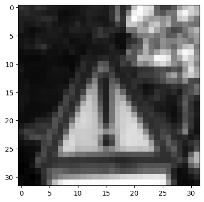
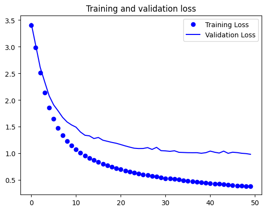

# Traffic Sign Recognition System using CNN

## Project Overview
This project focuses on the development of a convolutional neural network (CNN) to accurately classify traffic signs into 43 categories, leveraging TensorFlow and Keras. The system assists in improving the recognition capabilities of autonomous driving technologies and enhances road safety by accurate and real-time traffic sign detection.

## Dataset
The dataset used is the German Traffic Sign Recognition Benchmark (GTSRB), which includes 34,799 training images across 43 classes, such as speed limits, yield signs, and prohibitory signs. The data was preprocessed to grayscale to reduce model complexity and normalized to improve training efficiency.

## Model Architecture
- **Convolutional Layer**: Captures spatial hierarchies in the image data.
- **Max Pooling Layer**: Reduces the spatial dimensions to decrease computational load.
- **Flatten and Dense Layers**: Maps features to the output classes.
- **Activation**: 'ReLU' for hidden layers and 'Sigmoid' for output layer to handle multi-class classification.

## Results
- **Training Accuracy**: Peaked at 89.97% indicating strong learning on training data.
- **Validation Accuracy**: Reached 77.14%, showcasing the model’s effectiveness on unseen data.
- **Test Accuracy**: Achieved 74.32%, confirming the model’s generalization capability.

## Prediction Results

## Usage
Instructions to run the model, preprocess the data, and visualize the predictions are included, enabling users to replicate the results or use the model as a starting point for further experimentation.

## Future Work
Plans to incorporate real-time detection capabilities and expand the dataset to include signs from other regions to increase the robustness and applicability of the model globally.

 
